# ERD 설계

이 문서는 최종 ERD DDL을 기준으로 백엔드 엔티티와 DB 구현 기준을 정리합니다.

## 기본 기준

- DBMS: MySQL 8.0+
- 주요 PK: `BIGINT AUTO_INCREMENT`
- 생성/수정 시간: `created_at`, `updated_at`은 `DATETIME`
- soft delete 대상: `users`, `family_relation`, `course`, `photo`
- 복합키 매핑 테이블은 별도 surrogate key 없이 ERD의 복합 PK를 사용합니다.

## 테이블 목록

| No | 테이블 | 엔티티 | 설명 |
| --- | --- | --- | --- |
| 1 | `users` | `User` | 회원 |
| 2 | `tourism_preference` | `TourismPreference` | 관광 취향 마스터 |
| 3 | `food_preference` | `FoodPreference` | 음식 취향 마스터 |
| 4 | `facility` | `Facility` | 편의시설 마스터 |
| 5 | `user_onboarding_profile` | `UserOnboardingProfile` | 사용자 온보딩 단일 프로필 |
| 6 | `user_tourism_preference` | `UserTourismPreference` | 사용자별 관광 취향 |
| 7 | `user_food_preference` | `UserFoodPreference` | 사용자별 음식 취향 |
| 8 | `user_facility_preference` | `UserFacilityPreference` | 사용자별 필요 시설 |
| 9 | `family_relation` | `FamilyRelation` | 사용자 간 가족 관계 |
| 10 | `region` | `Region` | 지역 |
| 11 | `place` | `Place` | 장소 |
| 12 | `place_accessibility` | `PlaceAccessibility` | 장소별 접근성/편의시설 정보 |
| 13 | `course_interest_keyword` | `CourseInterestKeyword` | 코스 관심 키워드 마스터 |
| 14 | `course` | `Course` | 여행 코스 |
| 15 | `course_participant` | `CourseParticipant` | 코스 참여 사용자 snapshot |
| 16 | `course_keyword` | `CourseKeyword` | 코스별 관심 키워드 |
| 17 | `course_must_visit_place` | `CourseMustVisitPlace` | 코스 필수 방문 장소 |
| 18 | `course_schedule_item` | `CourseScheduleItem` | 확정 코스 일정 |
| 19 | `course_like` | `CourseLike` | 코스 찜 |
| 20 | `recommendation_job` | `RecommendationJob` | AI 추천 작업 |
| 21 | `recommendation_candidate` | `RecommendationCandidate` | 추천 후보 코스 |
| 22 | `recommendation_candidate_item` | `RecommendationCandidateItem` | 추천 후보 일정 |
| 23 | `album` | `Album` | 여행 앨범 |
| 24 | `photo` | `Photo` | 앨범 사진 |
| 25 | `video_generation_job` | `VideoGenerationJob` | 영상 생성 작업 |
| 26 | `review` | `Review` | 코스 리뷰 |
| 27 | `review_highlight` | `ReviewHighlight` | 리뷰 하이라이트 |
| 28 | `refresh_token` | `RefreshToken` | 인증 Refresh Token 세션 |

## Mermaid ERD

```mermaid
erDiagram
    USERS ||--|| USER_ONBOARDING_PROFILE : has
    USERS ||--o{ USER_TOURISM_PREFERENCE : selects
    TOURISM_PREFERENCE ||--o{ USER_TOURISM_PREFERENCE : selected_by
    USERS ||--o{ USER_FOOD_PREFERENCE : selects
    FOOD_PREFERENCE ||--o{ USER_FOOD_PREFERENCE : selected_by
    USERS ||--o{ USER_FACILITY_PREFERENCE : needs
    FACILITY ||--o{ USER_FACILITY_PREFERENCE : selected_by
    USERS ||--o{ FAMILY_RELATION : owns
    USERS ||--o{ FAMILY_RELATION : family_user

    REGION ||--o{ PLACE : contains
    PLACE ||--o{ PLACE_ACCESSIBILITY : has
    FACILITY ||--o{ PLACE_ACCESSIBILITY : describes

    USERS ||--o{ COURSE : creates
    REGION ||--o{ COURSE : selected_for
    COURSE ||--o{ COURSE_PARTICIPANT : includes
    USERS ||--o{ COURSE_PARTICIPANT : participates
    COURSE ||--o{ COURSE_KEYWORD : has
    COURSE_INTEREST_KEYWORD ||--o{ COURSE_KEYWORD : selected_by
    COURSE ||--o{ COURSE_MUST_VISIT_PLACE : requires
    PLACE ||--o{ COURSE_MUST_VISIT_PLACE : required_by
    COURSE ||--o{ COURSE_SCHEDULE_ITEM : has
    PLACE ||--o{ COURSE_SCHEDULE_ITEM : visited_at
    USERS ||--o{ COURSE_LIKE : likes
    COURSE ||--o{ COURSE_LIKE : liked_by

    COURSE ||--o{ RECOMMENDATION_JOB : requests
    RECOMMENDATION_JOB ||--o{ RECOMMENDATION_CANDIDATE : produces
    RECOMMENDATION_CANDIDATE ||--o{ RECOMMENDATION_CANDIDATE_ITEM : has
    PLACE ||--o{ RECOMMENDATION_CANDIDATE_ITEM : candidate_place

    COURSE ||--o{ ALBUM : has
    ALBUM ||--o{ PHOTO : contains
    USERS ||--o{ PHOTO : uploads
    PHOTO ||--o| ALBUM : cover_of
    ALBUM ||--o{ VIDEO_GENERATION_JOB : requests
    USERS ||--o{ VIDEO_GENERATION_JOB : requested_by

    COURSE ||--o{ REVIEW : receives
    USERS ||--o{ REVIEW : writes
    REVIEW ||--o{ REVIEW_HIGHLIGHT : has
```

## 핵심 컬럼 메모

### 사용자/온보딩

- `users`: `provider`, `provider_user_id`, `nickname`, `profile_image_url`, `email`, `created_at`, `updated_at`, `deleted_at`
- `refresh_token`: `user_id`, `token`, `expires_at`, `created_at`, `revoked_at`으로 서버 관리 Refresh Token 세션을 저장합니다.
- `user_onboarding_profile`: `user_id`를 PK/FK로 사용하고, 여행 기간/보행/휴식/계단/경사/매운맛 선호와 `onboarding_completed`를 저장합니다.
- 사용자 선호는 `user_tourism_preference`, `user_food_preference`, `user_facility_preference`에서 각각 `(user_id, *_id)` 복합키로 관리합니다.
- `family_relation`은 사용자 간 관계를 저장하며 `(user_id, family_user_id)`가 unique입니다.

### 장소/접근성

- `place`는 외부 관광 API 식별자인 `(content_id, content_type_id)` 조합이 unique입니다. `content_type_id`는 각 외부 API가 부여한 실제 분류 코드(관광공사 `contenttypeid`, 카카오 `category_group_code`)를 저장하며, 데이터 출처 구분(`TOUR_API`/`KAKAO`)은 별도의 `source` 컬럼에 저장합니다.
- `region_id`는 필수 FK입니다.
- `place_accessibility`는 `(place_id, facility_id)` 복합키를 사용하고 `status`, `source`, `verified_at`, `updated_at`을 가집니다.

### 코스/추천

- `course.creator_user_id`가 코스 작성자 FK입니다.
- `course`는 `region_id`, `title`, `start_date`, `end_date`, nullable `start_time`, `status`, `image_url`, `confirmed_at`을 가집니다.
- `course_participant`는 가족 구성원 테이블이 아니라 `users.user_id`를 참조하며, 이름/관계/프로필 snapshot을 함께 저장합니다.
- 확정 일정인 `course_schedule_item`과 추천 후보 일정인 `recommendation_candidate_item`은 `day_number`, `visit_order`, 시간, 다음 장소 이동 수단/거리/시간 컬럼 구조를 동일하게 유지합니다.

### 앨범/영상/리뷰

- `album.cover_photo_id`는 nullable이며 `photo` 생성 이후 FK가 연결됩니다.
- `photo`는 `uploader_user_id`, `file_key`, `thumbnail_key`, `caption`, `taken_at`, `deleted_at`을 사용합니다.
- `video_generation_job`은 앨범과 요청 사용자를 참조하고 상태/결과 파일 키/실패 메시지를 저장합니다.
- `review`는 `(course_id, user_id)` unique로 한 사용자가 한 코스에 리뷰를 하나만 작성합니다.
- `review_highlight`는 `(review_id, highlight_type)` 복합키입니다.

## Unique 제약

| 테이블 | 제약 |
| --- | --- |
| `users` | `(provider, provider_user_id)` |
| `refresh_token` | `token` |
| `tourism_preference` | `code` |
| `food_preference` | `code` |
| `facility` | `code` |
| `family_relation` | `(user_id, family_user_id)` |
| `region` | `(area_code, sigungu_code)` |
| `place` | `(content_id, content_type_id)` |
| `course_participant` | `(course_id, user_id)` |
| `course_interest_keyword` | `code` |
| `course_schedule_item` | `(course_id, day_number, visit_order)` |
| `recommendation_candidate` | `(recommendation_job_id, rank)` |
| `recommendation_candidate_item` | `(recommendation_candidate_id, day_number, visit_order)` |
| `review` | `(course_id, user_id)` |

## API 문서와 맞춰야 할 이름

| ERD 테이블 | API 리소스명 |
| --- | --- |
| `user_onboarding_profile` | `users/me/onboarding-profile` |
| `user_tourism_preference` | `users/me/preferences/tourism` |
| `user_food_preference` | `users/me/preferences/food` |
| `user_facility_preference` | `users/me/preferences/facilities` |
| `family_relation` | `family-relations` |
| `course_interest_keyword` | `course-keywords` |
| `course_must_visit_place` | `required-places` |
| `course_schedule_item` | `schedule-items` |
| `recommendation_job` | `recommendation-jobs` |
| `recommendation_candidate` | `recommendation-candidates` |
| `place_accessibility` | `accessibilities` |
