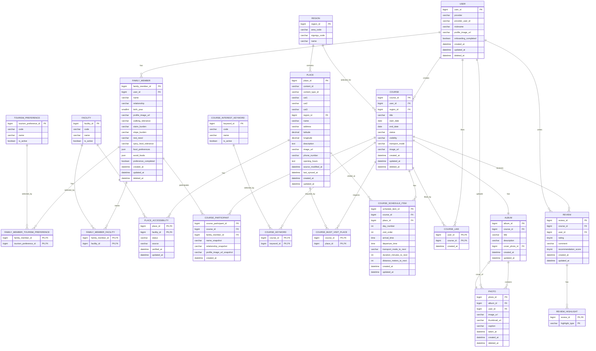

# ERD 설계

이 문서는 최종 ERD DDL(MySQL 8.0+, utf8mb4)을 기준으로 백엔드 엔티티와 DB 구현 기준을 정리합니다.

## 기본 기준

- DBMS: MySQL 8.0+
- Engine: InnoDB
- Charset: `utf8mb4`
- Collation: `utf8mb4_unicode_ci`
- PK: `BIGINT AUTO_INCREMENT`
- 시간 컬럼:
  - 생성일: `created_at DATETIME NOT NULL DEFAULT CURRENT_TIMESTAMP`
  - 수정일: `updated_at DATETIME NOT NULL DEFAULT CURRENT_TIMESTAMP ON UPDATE CURRENT_TIMESTAMP`
  - 삭제일: soft delete 대상 테이블만 `deleted_at DATETIME NULL`
- 삭제 API는 별도 명시가 없으면 soft delete를 기본으로 합니다.
- 예외: `review`는 `deleted_at` 컬럼이 없어 hard delete로 처리합니다.

## 테이블 목록

| No | 테이블 | 엔티티 | 설명 |
| --- | --- | --- | --- |
| 1 | `user` | `User` | 회원 |
| 2 | `family_member` | `FamilyMember` | 가족 구성원 |
| 3 | `tourism_preference` | `TourismPreference` | 관광 취향 마스터 |
| 4 | `family_member_tourism_preference` | `FamilyMemberTourismPreference` | 가족 구성원별 관광 취향 |
| 5 | `facility` | `Facility` | 편의시설 마스터 |
| 6 | `family_member_facility` | `FamilyMemberFacility` | 가족 구성원별 필요 시설 |
| 7 | `region` | `Region` | 지역 |
| 8 | `place` | `Place` | 장소 |
| 9 | `place_accessibility` | `PlaceAccessibility` | 장소별 접근성/편의시설 정보 |
| 10 | `course` | `Course` | 여행 코스 |
| 11 | `course_participant` | `CourseParticipant` | 코스 참여 가족 구성원 |
| 12 | `course_interest_keyword` | `CourseInterestKeyword` | 코스 관심 키워드 마스터 |
| 13 | `course_keyword` | `CourseKeyword` | 코스별 관심 키워드 |
| 14 | `course_must_visit_place` | `CourseMustVisitPlace` | 코스 필수 방문 장소 |
| 15 | `course_schedule_item` | `CourseScheduleItem` | 일자별 방문 일정 |
| 16 | `course_like` | `CourseLike` | 코스 찜 |
| 17 | `album` | `Album` | 여행 앨범 |
| 18 | `photo` | `Photo` | 앨범 사진 |
| 19 | `review` | `Review` | 만족도 평가/리뷰 |
| 20 | `review_highlight` | `ReviewHighlight` | 리뷰 하이라이트 |

## Mermaid ERD

## 주요 관계

| 관계 | 설명 |
| --- | --- |
| `user` 1:N `family_member` | 한 회원은 여러 가족 구성원을 등록할 수 있습니다. |
| `family_member` N:M `tourism_preference` | 가족 구성원별 관광 취향을 복합키 매핑 테이블로 관리합니다. |
| `family_member` N:M `facility` | 가족 구성원별 필요 시설을 복합키 매핑 테이블로 관리합니다. |
| `region` 1:N `place` | 장소는 하나의 지역에 속합니다. |
| `place` N:M `facility` | 장소별 편의시설 접근성 상태를 `place_accessibility`에서 관리합니다. |
| `user` 1:N `course` | 회원은 여러 코스를 생성할 수 있습니다. |
| `region` 1:N `course` | 코스는 하나의 대상 지역을 가집니다. |
| `course` N:M `family_member` | 코스 참여자는 snapshot 정보를 함께 저장합니다. |
| `course` N:M `course_interest_keyword` | 코스별 관심 키워드를 관리합니다. |
| `course` N:M `place` | 필수 방문 장소와 일정 방문 장소를 각각 분리해 관리합니다. |
| `user` N:M `course` | 코스 찜은 `course_like` 복합키로 관리합니다. |
| `course` 1:1 `album` | 하나의 코스는 하나의 앨범을 가집니다. |
| `album` 1:N `photo` | 앨범은 여러 사진을 가집니다. |
| `photo` 0:1 `album.cover_photo_id` | 앨범 커버 사진은 nullable FK이며 사진 삭제 시 `NULL` 처리합니다. |
| `course` N:M `user` | 리뷰는 코스와 작성자 조합으로 1개만 작성할 수 있습니다. |
| `review` 1:N `review_highlight` | 리뷰 하이라이트는 문자열 enum과 review_id 복합키로 관리합니다. |

## 제약 조건

### Unique

| 테이블 | 제약 |
| --- | --- |
| `user` | `(provider, provider_user_id)` |
| `tourism_preference` | `code` |
| `facility` | `code` |
| `region` | `(area_code, sigungu_code)` |
| `place` | `content_id` |
| `course_participant` | `(course_id, family_member_id)` |
| `course_interest_keyword` | `code` |
| `course_schedule_item` | `(course_id, day_number, visit_order)` |
| `album` | `course_id` |
| `review` | `(course_id, user_id)` |

### Check

| 테이블 | 컬럼 | 허용 값/조건 |
| --- | --- | --- |
| `place_accessibility` | `status` | `AVAILABLE`, `UNAVAILABLE`, `UNKNOWN` |
| `place_accessibility` | `source` | `TOUR_API`, `MANUAL`, `USER_REPORTED` |
| `course` | `end_date`, `start_date` | `end_date >= start_date` |
| `course` | `status` | `DRAFT`, `GENERATING`, `UPCOMING`, `COMPLETED`, `CANCELED` |
| `course` | `visibility` | `PRIVATE`, `FAMILY`, `PUBLIC` |
| `course` | `transport_mode` | `CAR`, `WALK`, `PUBLIC_TRANSPORT` |
| `course_schedule_item` | `day_number` | `day_number >= 1` |
| `course_schedule_item` | `visit_order` | `visit_order >= 1` |
| `course_schedule_item` | `transport_mode_to_next` | `NULL`, `CAR`, `WALK`, `PUBLIC_TRANSPORT` |
| `course_schedule_item` | `duration_minutes_to_next` | `NULL` 또는 `0` 이상 |
| `course_schedule_item` | `distance_meters_to_next` | `NULL` 또는 `0` 이상 |
| `review` | `rating` | `1` 이상 `5` 이하 |
| `review` | `recommendation_score` | `0` 이상 `10` 이하 |

## 인덱스

| 테이블 | 인덱스 | 목적 |
| --- | --- | --- |
| `family_member` | `idx_family_member_user(user_id)` | 회원별 가족 구성원 조회 |
| `place` | `idx_place_region_cat1(region_id, cat1)` | 지역/대분류 기준 장소 조회 |
| `place_accessibility` | `idx_place_accessibility_facility_status(facility_id, status)` | 편의시설/상태 기준 접근성 조회 |
| `course` | `idx_course_user_status(user_id, status)` | 회원별 코스 상태 조회 |
| `course` | `idx_course_region_start_date(region_id, start_date)` | 지역/시작일 기준 코스 조회 |
| `course_like` | `idx_course_like_course(course_id)` | 코스별 찜 수 또는 찜 여부 조회 |
| `photo` | `idx_photo_album_taken_at(album_id, taken_at)` | 앨범별 촬영일 기준 사진 조회 |

`course_schedule_item`은 별도 인덱스를 두지 않습니다. `uk_course_schedule_order(course_id, day_number, visit_order)`가 왼쪽 접두사 원칙으로 `(course_id, day_number)` 조회를 커버합니다.

## 도메인별 구현 메모

### 회원

- `user`는 MySQL에서 함수/계정 개념과 혼동될 수 있으므로 SQL 작성 시 필요하면 백틱을 사용합니다.
- `provider`, `provider_user_id` 조합으로 소셜 로그인 사용자를 식별합니다.
- 탈퇴는 `deleted_at`을 사용하는 soft delete입니다.

### 가족 구성원

- 가족 구성원은 회원에게 종속됩니다.
- 이동 부담, 음식 선호, 관광 취향, 필요 시설이 가족 구성원 단위로 관리됩니다.
- `food_preferences`, `avoid_foods`는 JSON으로 저장합니다.
- `preference_completed`로 가족 구성원별 선호 입력 완료 여부를 관리합니다.

### 장소/접근성

- `place.content_id`는 외부 관광 API 장소 식별자로 unique입니다.
- `content_type_id`, `cat1`, `cat2`, `cat3`는 관광 API 분류 값을 저장합니다.
- `opening_hours`는 장소 운영 시간 원문 또는 정규화 전 데이터를 저장하는 TEXT 컬럼입니다.
- 장소 접근성은 장소와 편의시설의 복합키로 관리합니다.

### 코스

- 코스는 작성자, 지역, 참여 가족 구성원, 관심 키워드, 필수 방문 장소, 일자별 일정을 가집니다.
- `course.status` 기본값은 `DRAFT`입니다.
- `course_participant`는 가족 구성원의 이름/관계/프로필 이미지를 snapshot으로 저장합니다.
- `course_schedule_item`은 `day_number`, `visit_order`로 하루 안의 방문 순서를 표현합니다.

### 앨범/사진

- `album.course_id`는 unique이므로 코스당 앨범은 1개입니다.
- `album.cover_photo_id`는 `photo` 생성 후 FK를 추가합니다.
- 커버 사진이 삭제되면 `ON DELETE SET NULL`로 앨범의 커버 참조를 제거합니다.
- 사진은 `deleted_at`을 사용하는 soft delete입니다.

### 리뷰

- `review`는 `(course_id, user_id)` unique 제약으로 한 사용자가 한 코스에 리뷰를 하나만 작성할 수 있습니다.
- `rating`은 1~5점입니다.
- `recommendation_score`는 0~10점입니다.
- 리뷰에는 `deleted_at`이 없으므로 삭제 API는 hard delete로 처리합니다.

## API 문서와 맞춰야 할 이름

| ERD 테이블 | API 문서에서 사용할 리소스명 |
| --- | --- |
| `course_interest_keyword` | `course-keywords` |
| `course_must_visit_place` | `required-places` |
| `course_schedule_item` | `schedule-items` |
| `place_accessibility` | `accessibilities` |
| `family_member_tourism_preference` | `family-members/{familyMemberId}/preferences` |
| `family_member_facility` | `family-members/{familyMemberId}/preferences` |
